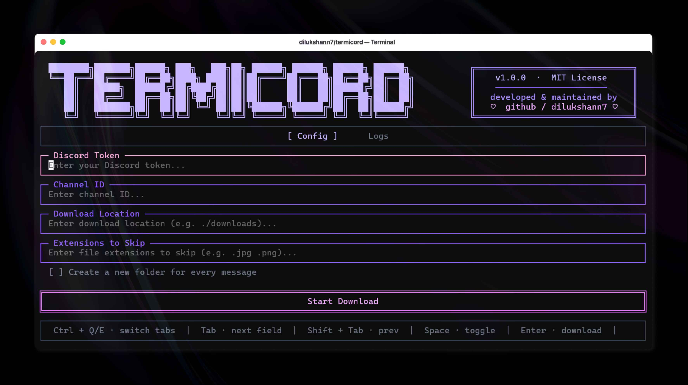

<div align="center">


<br />
<h2>A beautiful, terminal-native Discord attachment downloader</h2>
<p>Built with TypeScript · Powered by Bun · UI rendered by OpenTUI</p>

---

[](https://bun.sh)
[](https://www.typescriptlang.org)
[](https://github.com/anomalyco/opentui)
[](https://discord.com/developers/docs/intro)

</div>

---

## Overview

`termicord` is a sleek, fully terminal-native tool to **bulk-download all attachments from any Discord channel** you have access to. It talks directly to the Discord REST API v10, handles rate-limiting gracefully, and wraps everything in a gorgeous animated TUI — no browser, no Electron, no nonsense.

The interface is powered by **[OpenTUI](https://github.com/anomalyco/opentui)**, a Zig-native terminal UI library exposed to the JavaScript ecosystem via `@opentui/core`. This means pixel-perfect box rendering, smooth animations, mouse support, and focus management — all at near-native speed.

---

## Features

| Feature | Details |
|---|---|
| **Animated TUI** | Staggered banner + cascading panel reveal on startup |
| **Bulk Attachment Download** | Fetches every attachment from an entire channel history |
| **Batch Channels** | Comma-separated list of channel IDs — each processed sequentially into its own subfolder |
| **Auto Rate-Limit Handling** | Detects Discord 429 responses and backs off automatically |
| **Message Filtering** | Filter by author (username or ID), date range, and maximum message count |
| **File Size Filter** | Skip files above a configurable KB threshold |
| **Embed Media Download** | Optionally download images embedded in Discord messages, not just attachments |
| **Per-Message Folders** | Optional mode to create one folder per message, named by date + author + snippet |
| **Organise by File Type** | Auto-sort downloads into `images/`, `videos/`, `documents/`, `archives/`, `other/` |
| **Content-Hash Deduplication** | SHA-1 fingerprint of first 64 KB skips duplicate files within a run |
| **Custom Filename Template** | Token-based template: `{msgid}`, `{date}`, `{author}`, `{index}`, `{filename}`, `{ext}` |
| **Resume / Incremental Sync** | Remembers the last-seen message per channel and only fetches newer ones on re-run |
| **Extension Filtering** | Skip specific file types (e.g. `.jpg .png .gif`) before any download begins |
| **Named Profiles** | Save, switch, create, and delete multiple config profiles |
| **Config Persistence** | All settings auto-saved to `~/.config/termicord/config.json` |
| **Download History Tab** | Browsable log of past runs with file counts, sizes, and elapsed time |
| **Confirm Before Download** | Summary overlay before every run — confirm with `Y` or cancel with `N` |
| **Post-Run Summary** | Overlay after completion showing files downloaded, skipped, failed, size, and elapsed time |
| **Completion Notification** | Terminal bell + native OS notification (`notify-send` / `osascript` / `msg`) on finish |
| **Abort Support** | Press `Esc` at any time to cleanly cancel an in-flight download |
| **Live Log Tab** | Real-time timestamped log output with a scrollbar |
| **Export Log** | `Ctrl+S` on the Logs tab writes a timestamped `.log` file to the output directory |
| **Scrollable Config** | All config fields scroll cleanly in small terminal windows |
| **Responsive Layout** | Full-width banner on wide terminals, compact mode on narrow ones |
| **Mouse Support** | Click the Download button directly |
| **Duplicate Detection** | Skips files that already exist on disk |
| **Redirect Following** | Handles 301/302/307/308 redirects during binary downloads |
| **Retry with Back-off** | Three attempts with 1s/2s back-off; partial files cleaned up on failure |
| **DM / Thread / Forum Support** | Detects channel type via API and routes correctly |

---

## UI Powered by OpenTUI + Zig

The entire terminal interface is driven by **`@opentui/core`**, which is built on top of a **Zig**-native rendering engine. This gives the TUI:

- **Sub-millisecond render cycles** via Zig's zero-overhead abstractions
- **True-color (24-bit) support** — every hex color you see (`#c4b5fd`, `#f0abfc`, etc.) is rendered natively
- **Composable renderables** — `BoxRenderable`, `ScrollBoxRenderable`, `TextRenderable`, `InputRenderable` — each a self-contained layout node
- **Scrollable containers** — `ScrollBoxRenderable` with styled scrollbars, arrow buttons, and sticky-scroll for live log tailing
- **Event-driven input** — keyboard and mouse events propagate through a typed event bus backed by native I/O
- **Flex-style layout engine** — `flexDirection`, `justifyContent`, `alignItems` — a real layout system, not ASCII hacks

> Zig's `comptime` and manual memory model allow OpenTUI to avoid GC pauses entirely, making the UI feel instant even on low-spec hardware.

---

## Architecture

```
termicord/
├── index.ts        # TUI shell — all UI logic, layout, key bindings, animation
├── middleware.ts   # Thin adapter — bridges raw config from the UI to the backend
├── backend.ts      # Core engine — Discord API calls, download logic, abort support
├── config.ts       # Persistence — profiles, history, channel state, config file I/O
├── package.json    # Bun project manifest
└── tsconfig.json   # TypeScript config
```

### Data Flow

```
[ User Input (TUI) ]
        │
        ▼
[ config.ts: loadConfig() / saveConfig() ]
   ↳ Reads/writes ~/.config/termicord/config.json
   ↳ Manages named profiles, download history, channel resume state
        │
        ▼
[ middleware.ts: startDownloadTask() ]
   ↳ Parses raw string config (extensions, dates, sizes)
   ↳ Creates AbortController
        │
        ▼
[ backend.ts: runDownload() ]
   ↳ Resolves channel type via GET /channels/{id}
   ↳ Paginates messages (100/page, cursor-based, with resume support)
   ↳ Applies author / date / size / extension filters
   ↳ Downloads attachments + embeds with timeout, retry, redirect following
   ↳ Applies filename template, type-based subdirs, content-hash dedup
   ↳ Emits typed DownloadProgress events
        │
        ▼
[ index.ts: addLog() → logsBox (ScrollBoxRenderable) ]
   ↳ Timestamped lines rendered live in the Logs tab
   ↳ Progress bar updated on each file_done event
   ↳ History entry written to config on completion
```

---

## Requirements

| Dependency | Version |
|---|---|
| [Bun](https://bun.sh) | `>= 1.3.10` |
| [TypeScript](https://www.typescriptlang.org) | `^5.x` |
| [`@opentui/core`](https://www.npmjs.com/package/@opentui/core) | `^0.1.87` |

> **Node.js is not required.** This project runs exclusively on Bun.

---

## Installation

```
# 1. Clone the repository
git clone https://github.com/dilukshann7/termicord.git
cd termicord

# 2. Install dependencies
bun install

# 3. Launch
bun run index.ts
```

---

## Usage

When the TUI launches you will see the **Config** tab with all settings fields. Tab through them, fill in what you need, and press `Enter` or click the Download button.

### Config Fields

| Field | Description |
|---|---|
| **Discord Token** | Your user or bot token (`Authorization` header value) — masked by default |
| **Channel ID(s)** | One or more numeric channel IDs, comma-separated for batch mode |
| **Download Location** | Local path where files will be saved (default: `./downloads`) |
| **Extensions to Skip** | Space or comma-separated extensions to ignore (e.g. `.jpg .gif`) |
| **Filter by Author** | Username substring or exact user ID — blank means all authors |
| **Date From / Date To** | Inclusive date range in `YYYY-MM-DD` format — blank means no limit |
| **Message Limit** | Maximum number of messages to fetch — blank means the full history |
| **Max File Size (KB)** | Skip files larger than this — blank means no limit |
| **Filename Template** | Template string for output filenames (see tokens below) |
| **Folder per message** | Creates one named subfolder per message |
| **Save .txt** | Saves message text alongside attachments |
| **Download embed images** | Also downloads images embedded in messages |
| **Organise by file type** | Sorts files into `images/`, `videos/`, `documents/`, `archives/`, `other/` |
| **Deduplicate by hash** | Skips files whose content matches something already downloaded this run |

### Filename Template Tokens

| Token | Replaced with |
|---|---|
| `{msgid}` | Discord message snowflake ID |
| `{date}` | Message date (`YYYY-MM-DD`) |
| `{author}` | Message author username |
| `{index}` | Per-message file index (zero-padded) |
| `{filename}` | Original filename without extension |
| `{ext}` | File extension (without leading dot) |

Default: `{msgid}_{filename}`

### Keyboard Shortcuts

| Key | Action |
|---|---|
| `Tab` | Focus next field |
| `Shift+Tab` | Focus previous field |
| `Space` | Toggle focused checkbox |
| `Enter` | Start download (from any field or checkbox) |
| `Ctrl+Q` | Switch to Config tab |
| `Ctrl+E` | Switch to Logs tab |
| `Ctrl+R` | Switch to History tab |
| `Ctrl+S` | Export log to file (on Logs tab) |
| `Ctrl+H` / `Ctrl+T` | Toggle token mask |
| `Ctrl+N` | Create new profile |
| `Ctrl+D` | Delete current profile |
| `Ctrl+←` / `Ctrl+→` | Switch between profiles |
| `Y` / `N` | Confirm / cancel the pre-download dialog |
| `Esc` | Abort an in-progress download, or return to Config tab |
| `Ctrl+C` | Exit the application |

---

## How It Works

### Message Pagination

Discord's API returns a maximum of **100 messages per request**. The backend uses cursor-based pagination — each batch uses the snowflake ID of the last message as the `before` parameter — until an empty page signals the end of history. When a resume point is saved, the first request uses `after=` instead to fetch only newer messages.

### Rate Limiting

When Discord returns a `429 Too Many Requests` response, the backend parses the `retry_after` field from the JSON body and sleeps for exactly that duration before retrying. A 500ms inter-page sleep is applied proactively between all paginated requests.

### Abort / Cancellation

Every download task receives a standard [`AbortSignal`](https://developer.mozilla.org/en-US/docs/Web/API/AbortSignal). The inner loop checks `signal.aborted` before each message and before each file, so cancellation is clean and immediate with no partial files left on disk.

### File Safety

Before writing any file, the engine checks `fs.existsSync(destPath)`. If the file already exists it is skipped with an `↩ Already exists` log line. With deduplication enabled, a SHA-1 hash of the first 64 KB is also checked against all files downloaded in the current run.

### Config Persistence

Settings are stored in `~/.config/termicord/config.json` (falls back to `.termicord-config.json` in the working directory if the home directory is not writable). The file is written on every field change, so settings survive crashes. Up to 50 history entries are retained.

---

## Security Notes

> **Your Discord token is sensitive.** Treat it like a password.

- Tokens are stored in the config file at rest — use appropriate file permissions (`chmod 600`).
- The token field is masked by default (`•` bullets). Toggle with `Ctrl+H` or `Ctrl+T`.
- Tokens are transmitted exclusively to `discord.com` over HTTPS.

**Do not share your token.** Account tokens grant full access to your Discord account. Bot tokens should be scoped to only the required permissions.

---

## Contributing

Pull requests are welcome. For major changes please open an issue first to discuss what you would like to change.

```
# Fork → clone your fork → create a branch
git checkout -b feat/my-improvement

# Make changes, then push
git push origin feat/my-improvement

# Open a PR on GitHub
```

---

## License

Released under the [MIT License](./LICENSE).  
Developed & maintained with ♡ by **[@dilukshann7](https://github.com/dilukshann7)**

---

<div align="center">

*Built with* ♡ *using* **TypeScript** · **Bun** · **OpenTUI** · **Zig**

</div>
